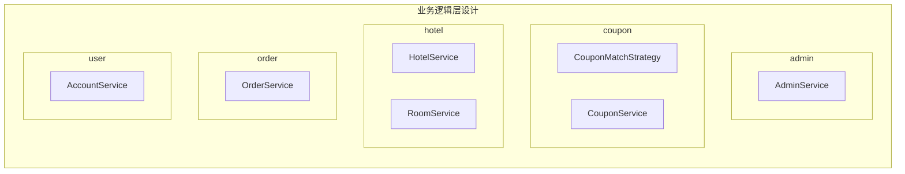

需求规格说明模板.md需求规格说明模板.md# 软件体系结构文档模板

## 文档修改历史

| 修改人员 | 日期 | 修改原因 | 版本号 |
| :------: | --------- |:------------------:| ------ |
|   hmb    | 2020.4.24 | 完成6数据持久化     |    0    |
|   zjc    | 2020.4.24 | 修改4.2，4.3，5.1  |    1    |
|   zjc    | 2020.4.25 | 完善5.1表格        |    2    |
|   hmb    | 2020.4.25 | 完成5.3业务逻辑     |   3     |
|   lz     | 2020.4.25 | 完成4.1开发包图、5.2用户界面层分解     |   4     |

todo:
    评价：hmb
    
todo:
    删除一些没有的

## 0、目录
<!-- toc -->
- [软件体系结构文档模板](#软件体系结构文档模板)
    - [文档修改历史](#文档修改历史)
    - [0、目录](#0、目录)
    - [1、引言](#1、引言)
        - [1、1、编制目的](#1、1、编制目的)
        - [1、2、词汇表](#1、2、词汇表)
        - [1、3、参考资料](#1、3、参考资料)
    - [2、产品概述](#2、产品概述)
    - [3、逻辑视图](#3、逻辑视图)
    - [4、组合视图](#4、组合视图)
        - [4、1、开发包图](#4、1、开发包图)
        - [4、2、运行时进程](#4、2、运行时进程)
        - [4、3、物理部署](#4、3、物理部署)
    - [5、架构设计](#5、架构设计)
        - [5、1、模块职责](#5、1、模块职责)
        - [5、2、用户界面层分解](#5、2、用户界面层分解)
            - [5、2、1、职责](#5、2、1、职责)
            - [5、2、2、接口规范](#5、2、2、接口规范)
        - [5、3、业务逻辑层分解](#5、3、业务逻辑层分解)
            - [5、3、1、职责](#5、3、1、职责)
            - [5、3、2、接口规范](#5、3、2、接口规范)
        - [5、4、数据层分解](#5、4、数据层分解)
            - [5、4、1、职责](#5、4、1、职责)
            - [5、4、2、接口规范](#5、4、2、接口规范)
    - [6、信息视角](#6、信息视角)
        - [6、1、数据持久化对象](#6、1、数据持久化对象)
        - [6、2、数据库表](#6、2、数据库表)

## 1、引言

### 1、1、编制目的
- 本报告详细完成对酒店预订系统的概要设计, 达到指导详细设计和开发的目的, 同时实现和测试人员及用户的沟通。

- 本报告面向开发人员、测试人员和最终用户而编写, 是了解系统的导航

### 1、2、词汇表

| 词汇名称 | 词汇含义 | 备注 |
| :------: | -------- | ---- |
|     HRS     |   酒店预订系统       |      |
|     bl    |   业务逻辑      |      |

### 1、3、参考资料
-  丁二玉,刘钦.计算与软件工程(卷二) \[M\]机械⼯工业出版社,2012:134—182
-  需求规格说明

## 2、产品概述

HRS是为某创业公司开发的业务系统， 开发的目标是方便人们出行中的酒店预订，包括下列功能：
- 全面展现任一个地域内的酒店信息，帮助顾客进行更好地比较与选择；
-  执行信用累计制度，防范恶意预订；
- 进行房客评价，反映酒店与描述的相符程度；
- 让酒店可以及时了解到所有预订订单的变化动态；
- 帮助顾客建立体验历史记录，在顾客预订时发挥历史记录的作用。
- 历史记录

通过HRS, 期望为客户提供互联网模式下的新型预定酒店方式。

## 3、逻辑视图

- 处理静态设计模型

  - HRS选择了分层体系结构风格, 将系统分为三层（展示层、业务逻辑层、数据层）能够很好地示意整个高层抽象。展示层包含GUI页面的实现, 业务逻辑层包含业务逻辑处理的实现, 数据层负责数据的持久化和访问。分层体系结构的逻辑视角如图所示。
     

- 软件体系结构逻辑设计方案示意图
<!-- 在这里画一个通用的包图，供复制 -->
<a href="https://mermaid-js.github.io/mermaid-live-editor/#/edit/eyJjb2RlIjoiZ3JhcGggVEJcbiAgc3ViZ3JhcGgg5qCH6aKYXG4gICAgc3ViZ3JhcGggcHJlc2VudGF0aW9uc1xuICAgICAgYTFbYWRtaW5dXG4gICAgICBjMVtjb3Vwb25dXG4gICAgICBoMVtob3RlbF1cbiAgICAgIG8xW29yZGVyXVxuICAgICAgdTFbdXNlcl1cbiAgICAgIE1BSU5fVUktLT5hMVxuICAgICAgTUFJTl9VSS0tPmMxXG4gICAgICBNQUlOX1VJLS0-aDFcbiAgICAgIE1BSU5fVUktLT5vMVxuICAgICAgTUFJTl9VSS0tPnUxXG4gICAgZW5kXG4gICAgc3ViZ3JhcGggY29udHJvbGxlclxuICAgICAgYTJbYWRtaW5dXG4gICAgICBjMltjb3Vwb25dXG4gICAgICBoMltob3RlbF1cbiAgICAgIG8yW29yZGVyXVxuICAgICAgdTJbdXNlcl1cbiAgICBlbmRcbiAgICBzdWJncmFwaCBidXNpbmVzcyBsb2dpY1xuICAgICAgYTNbYWRtaW5dXG4gICAgICBjM1tjb3Vwb25dXG4gICAgICBoM1tob3RlbF1cbiAgICAgIG8zW29yZGVyXVxuICAgICAgdTNbdXNlcl1cbiAgICBlbmRcbiAgICBwb1xuICAgIHN1YmdyYXBoIGRhdGFcbiAgICAgIGE0W2FkbWluXVxuICAgICAgYzRbY291cG9uXVxuICAgICAgaDRbaG90ZWxdXG4gICAgICBvNFtvcmRlcl1cbiAgICAgIHU0W3VzZXJdXG4gICAgZW5kXG4gICAgYTEtLXZvLS0-YTJcbiAgICBjMS0tdm8tLT5jMlxuICAgIGgxLS12by0tPmgyXG4gICAgbzEtLXZvLS0-bzJcbiAgICB1MS0tdm8tLT51MlxuICAgIGEyLS0-YTNcbiAgICBjMi0tPmMzXG4gICAgaDItLT5oM1xuICAgIG8yLS0-bzNcbiAgICB1Mi0tPnUzXG4gICAgYTMtLT5hNFxuICAgIGMzLS0-YzRcbiAgICBoMy0tPmg0XG4gICAgbzMtLT5vNFxuICAgIHUzLS0-dTRcbiAgZW5kIiwibWVybWFpZCI6eyJ0aGVtZSI6ImRlZmF1bHQifSwidXBkYXRlRWRpdG9yIjpmYWxzZX0" target="_blank"><B>Here</B></a>
<!-- 有4种模式， LR,TB,RL,BT -->
![软件体系结构逻辑设计方案](https://mermaid.ink/img/eyJjb2RlIjoiZ3JhcGggVEJcbiAgc3ViZ3JhcGgg5qCH6aKYXG4gICAgc3ViZ3JhcGggcHJlc2VudGF0aW9uc1xuICAgICAgYTFbYWRtaW5dXG4gICAgICBjMVtjb3Vwb25dXG4gICAgICBoMVtob3RlbF1cbiAgICAgIG8xW29yZGVyXVxuICAgICAgdTFbdXNlcl1cbiAgICAgIE1BSU5fVUktLT5hMVxuICAgICAgTUFJTl9VSS0tPmMxXG4gICAgICBNQUlOX1VJLS0-aDFcbiAgICAgIE1BSU5fVUktLT5vMVxuICAgICAgTUFJTl9VSS0tPnUxXG4gICAgZW5kXG4gICAgc3ViZ3JhcGggY29udHJvbGxlclxuICAgICAgYTJbYWRtaW5dXG4gICAgICBjMltjb3Vwb25dXG4gICAgICBoMltob3RlbF1cbiAgICAgIG8yW29yZGVyXVxuICAgICAgdTJbdXNlcl1cbiAgICBlbmRcbiAgICBzdWJncmFwaCBidXNpbmVzcyBsb2dpY1xuICAgICAgYTNbYWRtaW5dXG4gICAgICBjM1tjb3Vwb25dXG4gICAgICBoM1tob3RlbF1cbiAgICAgIG8zW29yZGVyXVxuICAgICAgdTNbdXNlcl1cbiAgICBlbmRcbiAgICBwb1xuICAgIHN1YmdyYXBoIGRhdGFcbiAgICAgIGE0W2FkbWluXVxuICAgICAgYzRbY291cG9uXVxuICAgICAgaDRbaG90ZWxdXG4gICAgICBvNFtvcmRlcl1cbiAgICAgIHU0W3VzZXJdXG4gICAgZW5kXG4gICAgYTEtLXZvLS0-YTJcbiAgICBjMS0tdm8tLT5jMlxuICAgIGgxLS12by0tPmgyXG4gICAgbzEtLXZvLS0-bzJcbiAgICB1MS0tdm8tLT51MlxuICAgIGEyLS0-YTNcbiAgICBjMi0tPmMzXG4gICAgaDItLT5oM1xuICAgIG8yLS0-bzNcbiAgICB1Mi0tPnUzXG4gICAgYTMtLT5hNFxuICAgIGMzLS0-YzRcbiAgICBoMy0tPmg0XG4gICAgbzMtLT5vNFxuICAgIHUzLS0-dTRcbiAgZW5kIiwibWVybWFpZCI6eyJ0aGVtZSI6ImRlZmF1bHQifX0)
  

## 4、组合视图

### 4、1、开发包图

- 酒店预订系统的开发包如图所示

|      开发包       | 依赖的其他开发包                                             |
| :---------------: | ------------------------------------------------------------ |
|      mainui       | adminui, couponui, hotelui, orderui, userui, vo              |
|      adminui      | adminblservice, 界面类库包, vo                               |
|  adminblservice   | HTTP, vo                                                     |
|      adminbl      | adminblservice, admindataservice, po                         |
| admindataservice  | po                                                           |
|     admindata     | databaseutility, po, admindataservice                        |
|     couponui      | couponservice, 界面类库包, vo                                |
|  couponblservice  | HTTP, vo                                                     |
|     couponbl      | couponblservice, coupondataservice, po, adminbl, hotelbl     |
| coupondataservice | po                                                           |
|    coupondata     | databaseutility, po, coupondataservice                       |
|      hotelui      | hotelservice, 界面类库包, vo                                 |
|  hotelblservice   | HTTP, vo                                                     |
|      hotelbl      | hotelblservice, hoteldataservice, po, adminbl                |
| hoteldataservice  | po                                                           |
|     hoteldata     | databaseutility, po, hoteldataservice                        |
|      orderui      | orderservice, 界面类库包, vo                                 |
|  orderblservice   | HTTP, vo                                                     |
|      orderbl      | orderblservice, orderdataservice, po, couponbl, hotelbl, userbl |
| orderdataservice  | po                                                           |
|     orderdata     | databaseutility, po, orderdataservice                        |
|      userui       | userservice, 界面类库包, vo                                  |
|   userblservice   | HTTP, vo                                                     |
|      userbl       | userblservice, userdataservice, po                           |
|  userdataservice  | po                                                           |
|     userdata      | databaseutility, po, userdataservice                         |
|        vo         |                                                              |
|        po         |                                                              |
|     utilitybl     |                                                              |
|    界面类库包     |                                                              |
|     HTTP          |                                                              |
|  databaseutility  | JDBC                                                         |

- 酒店预订系统客户端开发包图如图所示

- 酒店预订系统服务端开发包图如图所示

### 4、2、运行时进程
<!--zjc-->
&#160; &#160; &#160; &#160;在酒店管理系统中，会有多个客户端进程和一个服务器端进程，其进程图如图所示。结合部署图，客户端进程是在客户端机器上运行，服务器端进程在服务器端及其上运行。

### 4、3、物理部署
<!--zjc-->
&#160; &#160; &#160; &#160;酒店管理系统中客户端放在客户端机器上，服务器端是放在服务器端机器上。在服务端节点上，部署数据库形式的数据持久化保存。部署图如图所示。

## 5、架构设计

- 描述功能分解和如何在不同的层中安排软件模块
  - 描述架构中的对象，包含架构图
  - 描述组件接口信息
    - 包括：语法、前置条件、后置条件

### 5、1、模块职责
<!--zjc-->
&#160; &#160; &#160; &#160;客户端模块和服务器端模块试图如图7和图8所示。

&#160; &#160; &#160; &#160;客户端各层和服务器端各层的职责如表2和表3所示。

&#160; &#160; &#160; &#160;**表2：客户端各层的职责**

 <table width="609.00" border="0" cellpadding="0" cellspacing="0" style='width:365.40pt;border-collapse:collapse;table-layout:fixed;'>
         <col width="190" style='mso-width-source:userset;mso-width-alt:5558;'/>
         <col width="419" style='mso-width-source:userset;mso-width-alt:12258;'/>
         <tr height="45" style='height:27.00pt;mso-height-source:userset;mso-height-alt:540;'>
             <td class="xl65" height="45" width="190" style='text-align:center;white-space:normal;mso-pattern:auto none;background:#FFFFFF;color:#363636;font-size:12.0pt;font-weight:700;font-family:Segoe UI;mso-font-charset:134;border:.5pt solid windowtext;vertical-align: middle;height:27.00pt;width:114.00pt;'>层</td>
             <td class="xl66" width="419" style='text-align:center;white-space:normal;mso-pattern:auto none;background:#FFFFFF;color:#363636;font-size:12.0pt;font-weight:700;font-family:Segoe UI;mso-font-charset:134;border-top:.5pt solid windowtext;border-right:1.0pt solid windowtext;border-bottom:.5pt solid windowtext;vertical-align: middle;width:251.40pt;'>职责</td>
         </tr>
         <tr height="50" style='height:30.00pt;mso-height-source:userset;mso-height-alt:600;'>
             <td class="xl67" height="50" style='text-align:center;white-space:normal;mso-pattern:auto none;background:#FFFFFF;color:#363636;font-size:12.0pt;font-family:Segoe UI;mso-font-charset:134;border-left:.5pt solid windowtext;border-right:.5pt solid windowtext;vertical-align: middle;height:30.00pt;'>启动模块</td>
             <td  style='text-align:center;white-space:normal;mso-pattern:auto none;background:#FFFFFF;color:#363636;font-size:12.0pt;font-family:Segoe UI;mso-font-charset:134;border-right:1.0pt solid windowtext;vertical-align: middle;' class="xl68">初始化网络通讯机制，启动用户页面</td>
         </tr>
         <tr height="50" style='height:30.00pt;mso-height-source:userset;mso-height-alt:600;'>
             <td class="xl69" height="50" style='text-align:center;white-space:normal;mso-pattern:auto none;background:#F9F8FC;color:#363636;font-size:12.0pt;font-family:Segoe UI;mso-font-charset:134;border-left:.5pt solid windowtext;border-right:.5pt solid windowtext;vertical-align: middle;height:30.00pt;'>用户界面层</td>
             <td  style='text-align:center;white-space:normal;mso-pattern:auto none;background:#F9F8FC;color:#363636;font-size:12.0pt;font-family:Segoe UI;mso-font-charset:134;border-right:1.0pt solid windowtext;vertical-align: middle;' class="xl70">展示界面</td>
         </tr>
         <tr height="50" style='height:30.00pt;mso-height-source:userset;mso-height-alt:600;'>
             <td class="xl71" height="50" style='text-align:center;white-space:normal;mso-pattern:auto none;background:#F9F8FC;color:#363636;font-size:12.0pt;font-family:Segoe UI;mso-font-charset:134;border-left:.5pt solid windowtext;border-right:.5pt solid windowtext;border-bottom:1.0pt solid windowtext;vertical-align: middle;height:30.00pt;'>客户端网络模块</td>
             <td  style='text-align:center;white-space:normal;mso-pattern:auto none;background:#F9F8FC;color:#363636;font-size:12.0pt;font-family:Segoe UI;mso-font-charset:134;border-right:1.0pt solid windowtext;border-bottom:1.0pt solid windowtext;vertical-align: middle;' class="xl72">通过HTTP发出请求，与服务端进行通讯</td>
         </tr>
     </table>

&#160; &#160; &#160; &#160;**表3：服务端各层的职责**

<body link="blue" vlink="purple">
<meta charset="UTF-8">
<table width="613" border="0" cellpadding="0" cellspacing="0" style='width:367.80pt;border-collapse:collapse;table-layout:fixed;'>
    <col width="190" style='mso-width-source:userset;mso-width-alt:5558;'/>
    <col width="423.00" style='mso-width-source:userset;mso-width-alt:12375;'/>
    <tr height="45" style='height:27.00pt;mso-height-source:userset;mso-height-alt:540;'>
        <td class="xl65" height="45" width="190" style='text-align:center;white-space:normal;mso-pattern:auto none;background:#FFFFFF;color:#363636;font-size:12.0pt;font-weight:700;font-family:微软雅黑, sans-serif;mso-font-charset:134;border-left:1.0pt solid windowtext;border-top:1.0pt solid windowtext;border-right:.5pt solid windowtext;border-bottom:.5pt solid windowtext;vertical-align: middle;height:27.00pt;width:114.00pt;'>层</td>
        <td class="xl66" width="423.00" style='text-align:center;white-space:normal;mso-pattern:auto none;background:#FFFFFF;color:#363636;font-size:12.0pt;font-weight:700;font-family:微软雅黑, sans-serif;mso-font-charset:134;border-top:1.0pt solid windowtext;border-right:1.0pt solid windowtext;border-bottom:.5pt solid windowtext;vertical-align: middle;width:253.80pt;'>职责</td>
    </tr>
    <tr height="50" style='height:30.00pt;mso-height-source:userset;mso-height-alt:600;'>
        <td class="xl67" height="50" style='text-align:center;white-space:normal;mso-pattern:auto none;background:#FFFFFF;color:#363636;font-size:12.0pt;font-family:微软雅黑, sans-serif;mso-font-charset:134;border-left:1.0pt solid windowtext;border-right:.5pt solid windowtext;vertical-align: middle;height:30.00pt;'>启动模块</td>
        <td  style='text-align:center;white-space:normal;mso-pattern:auto none;background:#FFFFFF;color:#363636;font-size:12.0pt;font-family:微软雅黑, sans-serif;mso-font-charset:134;border-right:1.0pt solid windowtext;vertical-align: middle;' class="xl68">化网络通讯机制，启动用户页面</td>
    </tr>
    <tr height="50" style='height:30.00pt;mso-height-source:userset;mso-height-alt:600;'>
        <td class="xl67" height="50" style='text-align:center;white-space:normal;mso-pattern:auto none;background:#FFFFFF;color:#363636;font-size:12.0pt;font-family:Segoe UI;mso-font-charset:134;border-left:.5pt solid windowtext;border-right:.5pt solid windowtext;vertical-align: middle;height:30.00pt;'>业务逻辑层</td>
        <td  style='text-align:center;white-space:normal;mso-pattern:auto none;background:#FFFFFF;color:#363636;font-size:12.0pt;font-family:Segoe UI;mso-font-charset:134;border-right:1.0pt solid windowtext;vertical-align: middle;' class="xl68">对用界面的输入进行响应并进行业务逻辑处理</td>
    </tr>    
    <tr height="50" style='height:30.00pt;mso-height-source:userset;mso-height-alt:600;'>
        <td class="xl69" height="50" style='text-align:center;white-space:normal;mso-pattern:auto none;background:#F9F8FC;color:#363636;font-size:12.0pt;font-family:微软雅黑, sans-serif;mso-font-charset:134;border-left:1.0pt solid windowtext;border-right:.5pt solid windowtext;vertical-align: middle;height:30.00pt;'>数据层</td>
        <td  style='text-align:center;white-space:normal;mso-pattern:auto none;background:#F9F8FC;color:#363636;font-size:12.0pt;font-family:微软雅黑, sans-serif;mso-font-charset:134;border-right:1.0pt solid windowtext;vertical-align: middle;' class="xl70">负责数据的持久化及数据访问接口</td>
    </tr>
    <tr height="50" style='height:30.00pt;mso-height-source:userset;mso-height-alt:600;'>
        <td class="xl71" height="50" style='text-align:center;white-space:normal;mso-pattern:auto none;background:#FFFFFF;color:#363636;font-size:12.0pt;font-family:微软雅黑, sans-serif;mso-font-charset:134;border-left:1.0pt solid windowtext;border-right:.5pt solid windowtext;border-bottom:1.0pt solid windowtext;vertical-align: middle;height:30.00pt;'>服务器网络模块</td>
        <td  style='text-align:center;white-space:normal;mso-pattern:auto none;background:#FFFFFF;color:#363636;font-size:12.0pt;font-family:微软雅黑, sans-serif;mso-font-charset:134;border-right:1.0pt solid windowtext;border-bottom:1.0pt solid windowtext;vertical-align: middle;' class="xl72">通过HTTP回应客户端请求，与客户端进行通讯</td>
    </tr>
</table>
</body>

 &#160; &#160; &#160; &#160;每一层知识使用下方直接接触的层。层与层之间仅仅是通过接口的调用来完成的。层之间调用的接口如表所示。

<table width="982.00" border="0" cellpadding="0" cellspacing="0" style='width:589.20pt;border-collapse:collapse;table-layout:fixed;'>
   <col width="342.00" style='mso-width-source:userset;mso-width-alt:10005;'/>
   <col width="331" style='mso-width-source:userset;mso-width-alt:9683;'/>
   <col width="309" style='mso-width-source:userset;mso-width-alt:9040;'/>
   <tr height="41.67" style='height:25.00pt;mso-height-source:userset;mso-height-alt:500;'>
    <td class="xl65" height="41.67" width="342.00" style='text-align:center;white-space:normal;mso-pattern:auto none;background:#FFFFFF;color:#363636;font-size:12.0pt;font-weight:700;font-family:微软雅黑, sans-serif;mso-font-charset:134;border-top:1.0pt solid windowtext;border-bottom:.5pt solid windowtext;vertical-align: middle;height:25.00pt;width:205.20pt;'>接口</td>
    <td class="xl66" width="331" style='text-align:center;white-space:normal;mso-pattern:auto none;background:#FFFFFF;color:#363636;font-size:12.0pt;font-weight:700;font-family:微软雅黑, sans-serif;mso-font-charset:134;border-left:.5pt solid windowtext;border-top:1.0pt solid windowtext;border-right:.5pt solid windowtext;border-bottom:.5pt solid windowtext;vertical-align: middle;width:198.60pt;'>服务调用方</td>
    <td class="xl65" width="309" style='text-align:center;white-space:normal;mso-pattern:auto none;background:#FFFFFF;color:#363636;font-size:12.0pt;font-weight:700;font-family:微软雅黑, sans-serif;mso-font-charset:134;border-top:1.0pt solid windowtext;border-bottom:.5pt solid windowtext;vertical-align: middle;width:185.40pt;'>服务提供方</td>
   </tr>
   <tr height="35" style='height:21.00pt;mso-height-source:userset;mso-height-alt:420;'>
    <td class="xl67" height="35" style='text-align:center;white-space:normal;mso-pattern:auto none;background:#F9F8FC;color:#363636;font-family:微软雅黑, sans-serif;mso-font-charset:134;vertical-align: middle;height:21.00pt;'>AdminService</td>
    <td class="xl68" rowspan="7" style='text-align:center;white-space:normal;color:#363636;font-size:12.0pt;font-family:微软雅黑, sans-serif;mso-font-charset:134;border:.5pt solid windowtext;vertical-align: middle;border-right:.5pt solid windowtext;border-bottom:.5pt solid windowtext;'>服务器端controller</td>
    <td class="xl69" rowspan="7" style='text-align:center;white-space:normal;color:#363636;font-size:12.0pt;font-family:微软雅黑, sans-serif;mso-font-charset:134;vertical-align: middle;border-right:none;border-bottom:.5pt solid windowtext;'>服务器端业务逻辑层</td>
   </tr>
   <tr height="35" style='height:21.00pt;mso-height-source:userset;mso-height-alt:420;'>
    <td class="xl70" height="35" style='text-align:center;white-space:normal;mso-pattern:auto none;background:#FFFFFF;color:#363636;font-family:微软雅黑, sans-serif;mso-font-charset:134;vertical-align: middle;height:21.00pt;'>CouponMatchStrategy</td>
   </tr>
   <tr height="35" style='height:21.00pt;mso-height-source:userset;mso-height-alt:420;'>
    <td class="xl67" height="35" style='text-align:center;white-space:normal;mso-pattern:auto none;background:#F9F8FC;color:#363636;font-family:微软雅黑, sans-serif;mso-font-charset:134;vertical-align: middle;height:21.00pt;'>CouponService</td>
   </tr>
   <tr height="35" style='height:21.00pt;mso-height-source:userset;mso-height-alt:420;'>
    <td class="xl70" height="35" style='text-align:center;white-space:normal;mso-pattern:auto none;background:#FFFFFF;color:#363636;font-family:微软雅黑, sans-serif;mso-font-charset:134;vertical-align: middle;height:21.00pt;'>HotelService</td>
   </tr>
   <tr height="35" style='height:21.00pt;mso-height-source:userset;mso-height-alt:420;'>
    <td class="xl67" height="35" style='text-align:center;white-space:normal;mso-pattern:auto none;background:#F9F8FC;color:#363636;font-family:微软雅黑, sans-serif;mso-font-charset:134;vertical-align: middle;height:21.00pt;'>RoomService</td>
   </tr>
   <tr height="35" style='height:21.00pt;mso-height-source:userset;mso-height-alt:420;'>
    <td class="xl70" height="35" style='text-align:center;white-space:normal;mso-pattern:auto none;background:#FFFFFF;color:#363636;font-family:微软雅黑, sans-serif;mso-font-charset:134;vertical-align: middle;height:21.00pt;'>OrderService</td>
   </tr>
   <tr height="35" style='height:21.00pt;mso-height-source:userset;mso-height-alt:420;'>
    <td class="xl73" height="35" style='text-align:center;white-space:normal;mso-pattern:auto none;background:#F9F8FC;color:#363636;font-family:微软雅黑, sans-serif;mso-font-charset:134;border-bottom:.5pt solid windowtext;vertical-align: middle;height:21.00pt;'>AccountService</td>
   </tr>
   <tr height="35" style='height:21.00pt;mso-height-source:userset;mso-height-alt:420;'>
    <td class="xl75" height="35" style='text-align:center;white-space:normal;mso-pattern:auto none;background:#FFFFFF;color:#363636;font-family:微软雅黑, sans-serif;mso-font-charset:134;vertical-align: middle;height:21.00pt;'>AdminMapper</td>
    <td class="xl76" rowspan="6" style='text-align:center;white-space:normal;mso-pattern:auto none;background:#FFFFFF;color:#363636;font-size:12.0pt;font-family:微软雅黑, sans-serif;mso-font-charset:134;border:.5pt solid windowtext;vertical-align: middle;border-right:.5pt solid windowtext;border-bottom:1.0pt solid windowtext;'>服务端业务逻辑层</td>
    <td class="xl77" rowspan="6" style='text-align:center;white-space:normal;mso-pattern:auto none;background:#FFFFFF;color:#363636;font-size:12.0pt;font-family:微软雅黑, sans-serif;mso-font-charset:134;vertical-align: middle;border-right:none;border-bottom:1.0pt solid windowtext;'>服务器端数据层</td>
   </tr>
   <tr height="35" style='height:21.00pt;mso-height-source:userset;mso-height-alt:420;'>
    <td class="xl67" height="35" style='text-align:center;white-space:normal;mso-pattern:auto none;background:#F9F8FC;color:#363636;font-family:微软雅黑, sans-serif;mso-font-charset:134;vertical-align: middle;height:21.00pt;'>CouponMapper</td>
   </tr>
   <tr height="35" style='height:21.00pt;mso-height-source:userset;mso-height-alt:420;'>
    <td class="xl70" height="35" style='text-align:center;white-space:normal;mso-pattern:auto none;background:#FFFFFF;color:#363636;font-family:微软雅黑, sans-serif;mso-font-charset:134;vertical-align: middle;height:21.00pt;'>HotelMapper</td>
   </tr>
   <tr height="35" style='height:21.00pt;mso-height-source:userset;mso-height-alt:420;'>
    <td class="xl67" height="35" style='text-align:center;white-space:normal;mso-pattern:auto none;background:#F9F8FC;color:#363636;font-family:微软雅黑, sans-serif;mso-font-charset:134;vertical-align: middle;height:21.00pt;'>RoomMapper</td>
   </tr>
   <tr height="35" style='height:21.00pt;mso-height-source:userset;mso-height-alt:420;'>
    <td class="xl70" height="35" style='text-align:center;white-space:normal;mso-pattern:auto none;background:#FFFFFF;color:#363636;font-family:微软雅黑, sans-serif;mso-font-charset:134;vertical-align: middle;height:21.00pt;'>OrderMapper</td>
   </tr>
   <tr height="35" style='height:21.00pt;mso-height-source:userset;mso-height-alt:420;'>
    <td class="xl80" height="35" style='text-align:center;white-space:normal;mso-pattern:auto none;background:#F9F8FC;color:#363636;font-family:微软雅黑, sans-serif;mso-font-charset:134;border-bottom:1.0pt solid windowtext;vertical-align: middle;height:21.00pt;'>AccountMapper</td>
   </tr>
   <![if supportMisalignedColumns]>
    <tr width="0" style='display:none;'>
    </tr>
   <![endif]>
  </table>

&#160; &#160; &#160; &#160;借用“顾客管理已有订单”用例来说明层之间的调用，如图所示。每一层之间都是由上层依赖了一个接口（需接口），而下层实现这个接口（供接口）。OrderService提供了Order界面所需要的所有业务逻辑功能。OrderMapper提供了对数据库的增、删、改、查等操作。这样的实现大大降低了层与层之间的耦合。

### 5、2、用户界面层分解

- 根据需求，系统存在13个用户界面：登录界面、客户主界面、订单管理界面、酒店搜索界面、新订单界面、网站营销人员主界面、优惠策略处理界面、制定优惠策略、网站管理员主界面、酒店管理界面、酒店工作人员主界面、酒店业务处理界面、修改客房信息界面。界面跳转如图所示：

- 服务端和客户端的界面设计接口是一致的，只是具体的页面不一样。用户界面类图如图所示：

#### 5、2、1、职责

- 用户界面层模块的职责如图所示：
| 模块 | 职责 |
| :--: | :---: |
|MainFrame|界面Frame；负责界面的显示和界面的跳转|

#### 5、2、2、接口规范

- 用户界面层模块的接口规范如图所示：
  <table width="726.00" border="0" cellpadding="0" cellspacing="0" style='width:435.60pt;border-collapse:collapse;table-layout:fixed;'>
   <col width="218.00" style='mso-width-source:userset;mso-width-alt:6377;'/>
   <col width="119" style='mso-width-source:userset;mso-width-alt:3481;'/>
   <col width="389" style='mso-width-source:userset;mso-width-alt:11380;'/>
   <tr height="40" style='height:24.00pt;mso-height-source:userset;mso-height-alt:480;'>
    <td class="xl65" height="120" width="218.00" rowspan="3" style='height:72.00pt;width:130.80pt;border-right:.5pt solid windowtext;border-bottom:.5pt solid windowtext;' x:str>MainFrame</td>
    <td class="xl65" width="119" style='width:71.40pt;' x:str>语法</td>
    <td class="xl65" width="389" style='width:233.40pt;' x:str>init(args:String[]);</td>
   </tr>
   <tr height="40" style='height:24.00pt;mso-height-source:userset;mso-height-alt:480;'>
    <td class="xl66" x:str>前置条件</td>
    <td class="xl67" x:str>无</td>
   </tr>
   <tr height="40" style='height:24.00pt;mso-height-source:userset;mso-height-alt:480;'>
    <td class="xl65" x:str>后置条件</td>
    <td class="xl68" x:str>显示Frame以及LoginPanel</td>
   </tr>
   <![if supportMisalignedColumns]>
    <tr width="0" style='display:none;'>
     <td width="218" style='width:131;'></td>
     <td width="119" style='width:71;'></td>
     <td width="389" style='width:233;'></td>
    </tr>
   <![endif]>
  </table>

#### 5、2、3、需要的服务接口

|         服务名         | 服务                   |
| :--------------------: | ---------------------- |
| blservice.loginservice | 登录界面的业务逻辑接口 |
| blservice.\*BLservice | 每个界面都有一个相应的业务逻辑接口 |

### 5、3、业务逻辑层分解
- 包括多个业务逻辑处理包: admin处理酒店管理人员相关,coupon处理优惠策略相关的业务,hotel处理酒店、客房相关的业务,order处理用户的各种订单,user处理各用户的其他信息。
<a href="https://mermaid-js.github.io/mermaid-live-editor/#/edit/eyJjb2RlIjoiZ3JhcGggUkxcbiAgc3ViZ3JhcGgg5Lia5Yqh6YC76L6R5bGC6K6-6K6hXG4gICAgc3ViZ3JhcGggYWRtaW5ibFxuICAgIEFkbWluU2VydmljZVxuICAgIGVuZFxuICAgIHN1YmdyYXBoIGNvdXBvbmJsXG4gICAgQ291cG9uTWF0Y2hTdHJhdGVneVxuICAgIENvdXBvblNlcnZpY2VcbiAgICBlbmRcbiAgICBzdWJncmFwaCBob3RlbGJsXG4gICAgSG90ZWxTZXJ2aWNlXG4gICAgUm9vbVNlcnZpY2VcbiAgICBlbmRcbiAgICBzdWJncmFwaCBvcmRlcmJsXG4gICAgT3JkZXJTZXJ2aWNlXG4gICAgZW5kXG4gICAgc3ViZ3JhcGggdXNlcmJsXG4gICAgQWNjb3VudFNlcnZpY2VcbiAgICBlbmRcblxuICAgIHN1YmdyYXBoIGFkbWluYmxJbXBsXG4gICAgQWRtaW5TZXJ2aWNlSW1wbFxuICAgIGVuZFxuICAgIHN1YmdyYXBoIGNvdXBvbmJsSW1wbFxuICAgIENvdXBvblNlcnZpY2VJbXBsXG4gICAgQmlydGhkYXlDb3Vwb25TdHJhdGVneUltcGxcbiAgICBUaW1lQ291cG9uU3RyYXRlZ3lJbXBsXG4gICAgVGFyZ2V0TW9uZXlDb3Vwb25TdHJhdGVneUltcGxcbiAgICBUYXJnZXRSb29tQ291cG9uU3RyYXRlZ3lJbXBsXG4gICAgZW5kXG4gICAgc3ViZ3JhcGggaG90ZWxibEltcGxcbiAgICBIb3RlbFNlcnZpY2VJbXBsXG4gICAgUm9vbVNlcnZpY2VJbXBsXG4gICAgZW5kXG4gICAgc3ViZ3JhcGggb3JkZXJibEltcGxcbiAgICBPcmRlclNlcnZpY2VJbXBsXG4gICAgZW5kXG4gICAgc3ViZ3JhcGggdXNlcmJsSW1wbFxuICAgIEFjY291bnRTZXJ2aWNlSW1wbFxuICAgIGVuZFxuXG4gICAgQWRtaW5TZXJ2aWNlSW1wbC0taW1wbGVtZW50cy0tPkFkbWluU2VydmljZVxuICAgIENvdXBvblNlcnZpY2VJbXBsLS1pbXBsZW1lbnRzLS0-Q291cG9uU2VydmljZVxuICAgIEhvdGVsU2VydmljZUltcGwtLWltcGxlbWVudHMtLT5Ib3RlbFNlcnZpY2VcbiAgICBSb29tU2VydmljZUltcGwtLWltcGxlbWVudHMtLT5Sb29tU2VydmljZVxuICAgIE9yZGVyU2VydmljZUltcGwtLWltcGxlbWVudHMtLT5PcmRlclNlcnZpY2VcbiAgICBBY2NvdW50U2VydmljZUltcGwtLWltcGxlbWVudHMtLT5BY2NvdW50U2VydmljZVxuICAgIFRpbWVDb3Vwb25TdHJhdGVneUltcGwtLWltcGxlbWVudHMtLT5Db3Vwb25NYXRjaFN0cmF0ZWd5XG4gICAgQmlydGhkYXlDb3Vwb25TdHJhdGVneUltcGwtLWltcGxlbWVudHMtLT5Db3Vwb25NYXRjaFN0cmF0ZWd5XG4gICAgVGFyZ2V0TW9uZXlDb3Vwb25TdHJhdGVneUltcGwtLWltcGxlbWVudHMtLT5Db3Vwb25NYXRjaFN0cmF0ZWd5XG4gICAgVGFyZ2V0Um9vbUNvdXBvblN0cmF0ZWd5SW1wbC0taW1wbGVtZW50cy0tPkNvdXBvbk1hdGNoU3RyYXRlZ3lcbiAgZW5kIiwibWVybWFpZCI6eyJ0aGVtZSI6ImRlZmF1bHQifSwidXBkYXRlRWRpdG9yIjpmYWxzZX0" target="_blank">&emsp;设计如图:</a>
以下只作为简单展示

#### 5、3、1、职责
模板 | 职责
---|---
adminbl | 提供酒店管理员相关的服务
couponbl | 提供优惠策略相关的服务
hotelbl | 提供处理酒店、客房相关的服务
orderbl | 提供处理用户各种订单的服务
userbl | 提供处理各用户其他信息的服务

#### 5、3、2、接口规范

  

  

  

  

### 5、4、数据层分解

#### 5、4、1、职责
| 模块                    | 职责                                                                        |
| :---------------------- | :-------------------------------------------------------------------------- |
| admindata         | 提供Admin相关数据载入, 集体保存、增、删、改、查服务。            |
| hoteldata      | 提供Hotel相关数据载入, 集体保存、增、删、改、查服务。 |
| roomdata | 提供Room相关数据载入, 集体保存、增、删、改、查服务。    |
| orderdata         | 提供Order相关数据载入, 集体保存、增、删、改、查服务。。            |
| accountdata         | 提供Account相关数据载入, 集体保存、增、删、改、查服务。           |
| coupondata         | 提供Coupon相关数据载入, 集体保存、增、删、改、查服务。            |

#### 5、4、2、接口规范
- admindata模块

  - 接口规范：

    | AdminMapper.addManager |  int addManager(User user);               |
    | :---------------------------------- | :------------------------------------------------------------------- |
    | 前置条件                            | 传入user非空且在原数据库中不存在 |
    | 后置条件                            | 在数据库中增加一个manager的记录                                           |

    | AdminMapper.getAllManagers |  List<User> getAllManagers();                             |
    | :---------------------------------- | :----------------------------------------------------------------- |
    | 前置条件                            | 无 |
    | 后置条件                            | 列表返回该系统上所有的酒店管理人员对象信息 |

- hoteldata

  - 接口规范：

    | HotelMapper.insertHotel | int insertHotel(Hotel hotel); |
    | :------------------------ | :--------------------------------- |
    | 前置条件                  | 提供非空的hotel对象                |
    | 后置条件                  | 添加酒店入数据库               |

    | HotelMapper.selectAllHotel |     List<HotelVO> selectAllHotel(); |
    | :--------------------------------- | :---------------------------------------- |
    | 前置条件                           | 提供合法的关键词                          |
    | 后置条件                           | 列表返回所有酒店的信息              |

    | HotelMapper.selectById |     HotelVO selectById(Integer id); |
    | :------------------------------ | :------------------------------- |
    | 前置条件                        |提供数据库中存在的酒店ID  |
    | 后置条件                        | 返回该酒店的详细信息 （以hotelVO格式）         |

    | HotelMapper.updateHotel |     void updateHotel(Hotel hotel); |
    | :------------------------------ | :------------------------------- |
    | 前置条件                        | 提供数据库中存在的酒店  |
    | 后置条件                        | 更新该酒店的信息         |

    | HotelMapper.selectMgrHotel |     List<HotelVO> selectMgrHotel(int id); |
    | :------------------------------ | :------------------------------- |
    | 前置条件                        | 提供数据库中存在的酒店管理员id  |
    | 后置条件                        | 返回该管理员管理的所有酒店         |

    | HotelMapper.selectMgrHotel |   int updateInfo(Integer hotelId, String name, String address, String bizRegion, String description, String hotelStar, String phoneNum); |
    | :------------------------------ | :------------------------------- |
    | 前置条件                        | 提供数据库中存在的酒店id  |
    | 后置条件                        | 更新该酒店的信息         |

    

- roomdata模块

  - 接口规范：

    | RoomMapper.updateRoomInfo | int updateRoomInfo(@Param("hotelId") Integer hotelId,@Param("roomType") String roomType,@Param("curNum") Integer curNum); |
    | :--------------------------------- | :-------------------------------------------- |
    | 前置条件                           | 启动预定酒店；hotelId, roomType必须存在, rooms数量为正整数                      |
    | 后置条件                           | 根据具体的hotelId，更新数据库客房房间数量                                     |

    | RoomMapper.insertRoom | int insertRoom(HotelRoom hotelRoom);|
    | :--------------------------------- | :-------------------------------------------- |
    | 前置条件                           | 提供非空的hotelroom参数                      |
    | 后置条件                           |    添加房间入数据库                               |

    | RoomMapper.getAllRoomList | List<HotelRoom> getAllRoomList();|
    | :--------------------------------- | :-------------------------------------------- |
    | 前置条件                           | 无                      |
    | 后置条件                           |    返回数据库中的所有房间信息                      |

    | RoomMapper.selectRoomsByHotelId | List<HotelRoom> selectRoomsByHotelId(Integer hotelId); |
    | :--------------------------------- | :----------------------------- |
    | 前置条件                           |   提供数据库中存在的hotelId          |
    | 后置条件                           |      返回酒店的所有房型        |

    | RoomMapper.getRoomTotalNum | int getRoomCurNum(Integer hotelId, String roomType); |
    | :----------------------------------- | :----------------------------------------------- |
    | 前置条件                             |    提供数据库中存在的房间类型                     |
    | 后置条件                             |          返回对应房间类型的总数              |

- orderdata模块

  - 接口规范：

    | OrderMapper.addOrder | int addOrder(Order order); |
    | :----------------------- | :--------------------------- |
    | 前置条件                 |   启动预定酒店；提供非空的orderVO对象      |
    | 后置条件                 | 如果该房间不允许被该用户订，则返回错误提示；否则，添加订单信息进入数据库     |

    | OrderMapper.getAllOrders | List<Order> getAllOrders(); |
    | :----------------------- | :---------------------- |
    | 前置条件                 | 无            |
    | 后置条件                 | 返回该系统上所有的订单                      |

    | OrderMapper.getUserOrders | List<Order> getUserOrders(int userid); |
    | :------------------------------ | :-------------------------------- |
    | 前置条件                        | 提供user数据库中存在的userId                     |
    | 后置条件                        | 根据具体的userId，列表返回该用户的所有订单              |
    
    | OrderMapper.getHotelOrders | List<Order> getHotelOrders(int hotelid); |
    | :------------------------------ | :-------------------------------- |
    | 前置条件                        | 提供hotel数据库中存在的hotelId           |
    | 后置条件                        |  根据具体的hotelId，列表返回该酒店的所有订单       |

    | OrderMapper.updateOrderState | int updateOrderState(int orderid, String orderState); |
    | :------------------------------ | :-------------------------------- |
    | 前置条件                        | 提供order数据库中存在的orderId，以及订单的目标状态orderState           |
    | 后置条件                        |  根据具体的orderId，更新数据库中该订单的状态       |

    | OrderMapper.getOrderById | Order getOrderById(int orderid); |
    | :------------------------------ | :-------------------------------- |
    | 前置条件                        | 提供order数据库中存在的orderId                     |
    | 后置条件                        |   返回对应订单的详细信息   |

    | OrderMapper.updateOutTime | int updateOutTime(int id, String outdate); |
    | :------------------------------ | :-------------------------------- |
    | 前置条件                        | 提供order数据库中存在的id，以及时间outdate           |
    | 后置条件                        |  根据具体的id，更新数据库中该订单完成的时间       |

    | OrderMapper.addComment | void addComment(int orderid, String comment, int commentScore) |
    | :------------------------------ | :-------------------------------- |
    | 前置条件                        | 提供order数据库中存在的id，以及评价信息           |
    | 后置条件                        |  根据具体的id，更新数据库中该订单的评价信息       |

- accountdata模块

  - 接口规范：

    | AccountMapper.createNewAccount |  int createNewAccount(User user); |
    | :----------------------- | :--------------------------- |
    | 前置条件                 |    启动注册；非空的user对象     |
    | 后置条件                 | 生成新的用户对象添加入数据库     |

    | AccountMapper.getAccountByName |User getAccountByName(String email); |
    | :------------------------------------ | :------------------------------------------------- |
    | 前置条件                              |     提供数据库中存在的email                      |
    | 后置条件                              |        返回user详细信息                    |

    | AccountMapper.getAccountById |  User getAccountById(int id);|
    | :-------------------------------- | :--------------------------------- |
    | 前置条件                          |      提供数据库中存在的userId              |
    | 后置条件                          |            返回user详细信息                        |

    | AccountMapper.updateAccount | int updateAccount(int id, String password, String username, String phonenumber); |
    | :---------------------------------- | :--------------------------------------------- |
    | 前置条件                            |     提供合法的userId;password,username,phonenumber |
    | 后置条件                            |        根据具体的userId以及传来的信息数据，更新该用户个人信息  |

    | AccountMapper.updateCredit |  void updateCredit(int id, double credit);|
    | :-------------------------------- | :--------------------------------- |
    | 前置条件                          |      提供数据库中存在的id，以及新的信用值  |
    | 后置条件                          |   根据具体的id以及传来的信息数据，更新该用户的信用值    |

    | AccountMapper.updateUserType |  void updateUserType(int id, String usertype);|
    | :-------------------------------- | :--------------------------------- |
    | 前置条件                          |      提供数据库中存在的id，以及新的用户类型  |
    | 后置条件                          |   根据具体的id以及传来的信息数据，更新该用户的用户类型    |

- coupondata模块

  - 接口规范：

    | CouponMapper.insertCoupon | int insertCoupon(Coupon coupon); |
    | :------------------------ | :--------------------------------- |
    | 前置条件                  |     提供非空的coupon对象；coupon携带的信息符合输入规则 |
    | 后置条件                  |                根据具体的coupon，往数据库中插入一个优惠券对象 |
    
    | CouponMapper.selectByHotelId | List<Coupon> selectByHotelId(Integer hotelId); |
    | :------------------------ | :--------------------------------- |
    | 前置条件                  |     提供数据库中存在的hotelId           |
    | 后置条件                  |     列表返回该hotel的全部优惠券   |

## 6、信息视角

### 6、1、数据持久化对象
&emsp;系统的PO类就是对应的相关的实体类，在此仅作简单介绍，

- 每一个PO类都具备完整的getter，setter方法，由于他们都放在PO包里面，所以它们的名字都没有后缀PO，图就不上传了。
- 关系详见下表：

|系统的PO类|所包含的属性|
|:-------:|:-----------:|
|Coupon|id description hotelId couponType couponName target_money discount status start_time end_time discount_money |
|Hotel|id hotelName hotelDescription address bizRegion hotelStar phoneNum rate manager_id commentNumber totalCommentScore hotelState|
|OrderList|id userId hotelId hotelName checkInDate checkOutDate roomType roomNum peopleNum haveChild createDate price tenantName phoneNumber orderState comment commentScore|
|Room|id price curNum total hotel_id roomType |
|User|id email password username phonenumber credit usertype |

### 6、2、数据库表
- 数据库包括`Coupon`, `Hotel`, `OrderList`, `Room`, `User`，共5个表，分别与上面5个PO类相对应